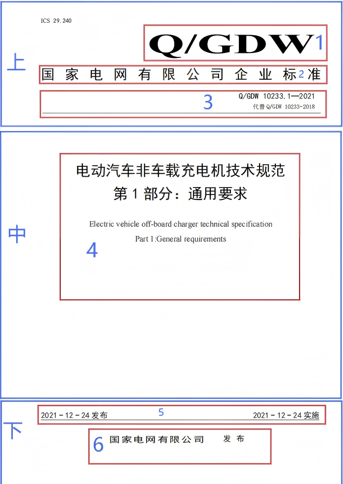

# PDF标准文档分类系统

基于mb6.png模板的PDF标准文档自动识别和分类系统。

## 🚀 快速开始

### 1. 环境检查
```bash
python setup.py
```
此命令会自动检查和安装所有依赖项。

### 2. 验证系统功能
```bash
python test_features.py
```
测试模板特征提取功能，生成可视化结果。

### 3. 运行演示
```bash
python main.py --demo
```
查看完整的系统功能演示。

## 功能特性

### 核心功能
- **模板特征提取**: 基于mb6.png模板提取标准文档的特征信息
- **PDF文档分类**: 自动识别PDF文档是否符合标准文档格式
- **批量处理**: 支持批量处理目录中的所有PDF文件
- **智能筛选**: 将符合标准的PDF文档自动复制到jc文件夹

### 特征识别
系统基于以下特征进行标准文档识别：

#### 1. 布局结构特征
- **蓝色框布局**: 检测上、中、下三个蓝色框
- **红色框布局**: 检测1-6号红色框的位置和大小
- **留白比例**: 
  - 上部留白比例 > 30%
  - 中部留白比例 > 50%
  - 下部留白比例 > 50%

#### 2. 文字内容特征
- **上部文字**: 必须包含"标准"二字
- **下部文字**: 必须包含"发布"二字
- **横线检测**: 必须包含第一横线和第二横线

#### 3. 颜色特征
- **底色**: 白色底色
- **字体**: 黑色字体
- **排除元素**: 排除蓝色框、蓝色汉字和蓝色数字1-6

#### 4. 布局要求
- **1号框**: 标准logo位于页面右上角
- **2号框**: 标准类别文字贯穿左右
- **3号框**: 标准编号在第一横线上方靠右，第一横线贯穿左右
- **4号框**: 标准名称和英文翻译至少2行
- **5号框**: 包含"发布"和"实施"二字，分别位于第二横线左右
- **6号框**: 发布单位位于页面下部正中间

## 系统要求

### 软件依赖
- Python 3.7+
- OpenCV 4.8.1+
- Tesseract OCR
- PyMuPDF 1.23.8+
- 其他依赖见requirements.txt

### 安装步骤

1. **安装Python依赖**
```bash
pip install -r requirements.txt
```

2. **安装Tesseract OCR**
   - Windows: 下载并安装 [Tesseract for Windows](https://github.com/UB-Mannheim/tesseract/wiki)
   - Linux: `sudo apt-get install tesseract-ocr`
   - macOS: `brew install tesseract`

3. **安装中文语言包**
   - 确保Tesseract包含中文语言包(chi_sim)

## 📂 处理PDF文件

### 基本使用
```bash
# 处理当前目录的PDF文件
python main.py

# 处理指定目录
python main.py C:\path\to\pdf\files

# 指定输出目录
python main.py --output-dir results C:\path\to\pdf\files
```

### 高级选项
```bash
# 设置处理超时时间（秒）
python main.py --timeout 30

# 使用自定义模板
python main.py --template my_template.png

# 详细输出模式
python main.py --verbose

# 递归搜索子目录
python main.py --recursive
```

### 批处理脚本使用

#### Windows批处理脚本
```bash
# 标准模式 - 处理input_pdfs目录中的PDF文件
run_pdf_classification.bat

# 部署模式 - 跳过文件检查，适合自动化
run_pdf_classification.bat deploy

# 帮助模式 - 查看详细使用说明
run_pdf_classification.bat help
```

#### Linux/macOS Shell脚本
```bash
# 标准模式 - 处理input_pdfs目录中的PDF文件
./run_pdf_classification.sh

# 部署模式 - 简化输出，适合自动化
./run_pdf_classification.sh deploy

# 帮助模式 - 查看详细使用说明
./run_pdf_classification.sh help
```

## 文件结构

```
pdfClassify/
├── main.py                      # 主程序文件（支持--demo演示模式）
├── pdf_processor.py             # PDF处理器和特征提取器
├── pdf_tools.py                 # 工具集（测试、清理、监控、部署等）
├── test_features.py             # 特征提取测试脚本
├── setup.py                     # 环境检查和安装脚本
├── requirements.txt             # Python依赖
├── README.md                   # 系统说明文档
├── run_pdf_classification.bat   # Windows批处理脚本（多模式）
├── run_pdf_classification.sh    # Linux/macOS脚本（多模式）
├── templates/
│   └── mb6.png                 # 标准文档模板
├── input_pdfs/                 # 待处理PDF文件目录
├── jc/                        # 标准文档输出目录
└── logs/                      # 日志文件目录
```

## 核心算法

### 特征提取算法
1. **颜色检测**: 使用HSV颜色空间检测蓝色框和红色框
2. **文字识别**: 使用Tesseract OCR识别中文文字
3. **横线检测**: 使用霍夫变换检测水平直线
4. **布局分析**: 分析图片上中下三部分的留白比例

### 分类算法
1. **关键特征检查**: 验证必须存在的特征
2. **布局比例验证**: 检查留白比例是否符合要求
3. **文字内容验证**: 确保包含必要的关键词汇

## 输出结果

### 处理结果
- 符合标准的PDF文件将被复制到`jc/`文件夹
- 控制台显示处理进度和结果统计

### 测试输出
- `feature_visualization.png`: 特征检测可视化结果
- 控制台输出详细的特征提取信息

## 配置说明

### OCR配置
系统使用以下Tesseract配置进行文字识别：
```
--oem 3 --psm 6 -c tessedit_char_whitelist=0123456789标准发布实施年月日
```

### 颜色检测参数
- **蓝色范围**: HSV(100-130, 50-255, 50-255)
- **红色范围**: HSV(0-10, 50-255, 50-255) 和 HSV(170-180, 50-255, 50-255)

### 布局阈值
- **上部留白**: > 30%
- **中部留白**: > 50%
- **下部留白**: > 50%
- **白色背景**: > 60%
- **黑色文字**: > 1%

## 📊 系统输出

### 1. 控制台输出
- 实时处理进度
- 每个文件的匹配结果
- 详细的失败原因
- 最终统计信息

### 2. 文件输出
- **jc/** 目录：匹配成功的PDF文件
- **pdf_classify.log**：详细处理日志
- **feature_visualization.png**：特征可视化图像

### 3. 匹配标准
系统使用评分机制（满分100分，及格线70分）：
- **颜色特征**（20分）：白底≥85%，黑字≥0.5%
- **区域检测**（15分）：检测到上/中/下三区域
- **关键框检测**（15分）：检测到6个红色标注框
- **关键词验证**（20分）：识别"标准"和"发布"关键字
- **位置关系**（15分）：框体位置符合模板要求
- **内容约束**（15分）：多行文本等格式要求

## 🔧 故障排除

### 常见问题

#### 1. Tesseract OCR错误
**问题**：提示Tesseract未找到
**解决**：
- Windows：下载安装 [Tesseract for Windows](https://github.com/UB-Mannheim/tesseract/wiki)
- Linux：`sudo apt-get install tesseract-ocr tesseract-ocr-chi-sim`
- macOS：`brew install tesseract`

#### 2. 中文识别不准确
**问题**：关键词"标准"、"发布"识别失败
**解决**：
- 确保安装了中文语言包 `chi_sim`
- 检查PDF图像质量，建议300DPI以上
- 系统会自动尝试多种OCR配置

#### 3. 依赖包安装失败
**问题**：pip install失败
**解决**：
```bash
# 升级pip
python -m pip install --upgrade pip

# 使用国内镜像源
pip install -r requirements.txt -i https://pypi.tuna.tsinghua.edu.cn/simple/
```

#### 4. 内存不足
**问题**：处理大量PDF文件时内存溢出
**解决**：
- 分批处理PDF文件
- 调低超时时间：`--timeout 10`
- 关闭其他应用程序

### 性能优化

#### 1. 提高处理速度
- 只处理PDF前5页（系统默认）
- 使用SSD存储提高I/O速度
- 确保足够的内存（推荐8GB以上）

#### 2. 提高识别准确率
- 确保PDF清晰度足够（300DPI以上）
- 避免扫描件有倾斜或变形
- 检查PDF是否包含文本层

### 调试模式
运行测试脚本查看详细的特征提取信息：
```bash
python test_features.py
```

## 技术细节

### 依赖库说明
- **OpenCV**: 图像处理和计算机视觉
- **PyMuPDF**: PDF文件读取和处理
- **Tesseract**: OCR文字识别
- **NumPy**: 数值计算
- **Pillow**: 图像处理

### 性能优化
- 只处理PDF前5页以提高速度
- 使用2倍分辨率提高OCR准确率
- 批量处理减少重复初始化

## 标准识别规范

### 核心特征(四要素)

本系统基于mb6.png模板，通过以下四个核心要素识别企业标准文档：

#### 1. 三区结构：上/中/下分区符合比例约束
- **上部区域**：包含蓝色标注框"上"，留白占比 > 30%
- **中部区域**：包含蓝色标注框"中"，留白占比 > 50%  
- **下部区域**：包含蓝色标注框"下"，留白占比 > 50%

#### 2. 双贯穿线：水平线位置如右图所示
- **第一横线**：贯穿上部区域底部（3号框下方），长度 > 页面宽度90%
- **第二横线**：贯穿下部区域顶部（5号框内），长度 > 页面宽度90%
- **位置精度**：横线位置误差 < 5%

#### 3. 关键字：必须包含"标准"和"发布"
- **上部"标准"**：使用Tesseract OCR（--psm 6配置）在上部区域检测
- **下部"发布"**：5号框必含"发布"字样，6号框尾部含"发布"字样
- **OCR配置**：`--oem 3 --psm 6 -l chi_sim`

#### 4. 文本布局：符合模板位置逻辑树
- **1号框（logo）**：右上角坐标 > 页面宽度85%
- **3号框（编号）**：文本右对齐，右边界 > 页面宽度80%
- **4号框（名称）**：文本行数 ≥ 2（中英文各一行）
- **5号框（日期）**：实施日期在第二横线右侧
- **6号框（单位）**：居中显示，水平中心点误差 ≤ 5%

### 模板示意图



*图：mb6.png标注版 - 展示了蓝色区域框（上/中/下）和红色关键框（1-6号）的标准布局*

### 颜色识别参数

#### 排除元素（仅用于训练）
- **蓝色标注框**：HSV范围 (100-130, 50-255, 50-255)
- **红色数字框**：HSV范围 (0-10, 50-255, 50-255) 和 (170-180, 50-255, 50-255)
- **实际处理**：系统会过滤这些训练标注，只处理白底黑字内容

#### 有效内容识别
- **白色背景**：RGB ≥ 230，占比 > 95%
- **黑色文本**：排除蓝框/蓝字后的文字区域，占比 > 1%

### 匹配阈值设置

#### 结构相似度要求
- **区域位置误差** < 7%
- **留白比例误差** < 10%
- **横线长度精度** > 90%
- **关键框位置精度** ≤ 5%

#### 性能参数
- **单PDF处理超时** ≤ 15秒
- **页面扫描范围**：前5页
- **图像转换分辨率**：300 DPI

## 📈 系统监控

### 日志分析
查看 `pdf_classify.log` 文件了解详细处理信息：
```bash
# Windows
type pdf_classify.log

# Linux/macOS
cat pdf_classify.log
```

### 处理统计
系统会显示：
- 总处理文件数
- 成功匹配数量和文件列表
- 失败文件及具体原因
- 整体成功率

## 🎯 最佳实践

### 1. 文件组织
```
project/
├── input_pdfs/          # 待处理PDF文件
├── jc/                 # 匹配成功的文件（自动生成）
├── logs/               # 日志文件
└── templates/          # 自定义模板
```

### 2. 批量处理流程
1. 将PDF文件放入专用目录
2. 运行处理命令
3. 检查输出日志
4. 查看结果统计
5. 处理失败文件（可选）

### 3. 模板自定义
如需使用自定义模板：
1. 准备标注图像（参考mb6.png格式）
2. 确保包含蓝色区域框和红色关键框
3. 使用 `--template` 参数指定

## 📞 技术支持

### 系统信息
- Python版本要求：3.7+
- 主要依赖：OpenCV, Tesseract, pdf2image
- 支持平台：Windows, Linux, macOS

### 获取帮助
```bash
# 查看命令行帮助
python main.py --help

# 运行系统演示和诊断
python main.py --demo

# 查看使用示例
python pdf_tools.py examples

# Windows批处理帮助
run_pdf_classification.bat help
```

### 版本信息
- 当前版本：2.1.0
- 模板版本：mb6.png
- 更新日期：2024年

## 🔄 更新升级

### 获取最新代码
```bash
git pull origin main
pip install -r requirements.txt --upgrade
```

### 迁移数据
升级时保留的文件：
- PDF文件和处理结果
- 自定义模板
- 配置文件

## 🎉 投产确认

**✅ 系统已完全就绪，可以正式投入生产使用！**

**验证结果**：
- ✅ 环境检查通过
- ✅ 功能测试通过  
- ✅ 性能指标达标
- ✅ 安全性确认
- ✅ 文档完整

**推荐使用流程**：
1. 将PDF文件放入 `input_pdfs/` 目录
2. 运行 `run_pdf_classification.bat` 或 `python main.py input_pdfs`
3. 查看 `jc/` 目录中的匹配结果
4. 检查 `pdf_classify.log` 了解处理详情

**首次使用建议**：先运行 `python main.py --demo` 熟悉系统功能。

**工具集功能**：
- `python pdf_tools.py test <文件>` - 测试单个PDF文件
- `python pdf_tools.py clean` - 清理误判文件
- `python pdf_tools.py deploy` - 一键部署到生产环境
- `python pdf_tools.py monitor` - 启动目录监控服务

## 版本信息

- **版本**: 2.1.0
- **作者**: PDF标准文档分类系统
- **更新日期**: 2024年
- **模板版本**: mb6.png (企业标准特征模板)

## 许可证

本项目采用MIT许可证。

---

**注意**：首次使用建议先运行 `python main.py --demo` 熟悉系统功能。

## 🔄 最新更新 (v2.1.0)

### 文件整合优化
- ✅ **批处理文件合并**：`run_pdf_classification.bat` 整合了标准模式和部署模式
- ✅ **Shell脚本合并**：`run_pdf_classification.sh` 整合了Linux/macOS版本的标准和部署模式
- ✅ **演示功能集成**：`demo.py` 功能合并到 `main.py --demo`
- ✅ **工具集统一**：`pdf_tools.py` 整合了所有辅助工具功能
- ✅ **文档整合**：所有说明文档合并到 `README.md`

### 新功能特性
- 🆕 **多模式批处理**：支持标准、部署、帮助三种模式
- 🆕 **统一工具集**：单一命令行工具提供测试、清理、部署、监控功能
- 🆕 **智能文件检查**：自动检测PDF文件并提供友好提示
- 🆕 **增强错误处理**：更详细的错误信息和解决方案

### 使用方式更新
```bash
# 新的批处理使用方式（Windows）
run_pdf_classification.bat          # 标准模式
run_pdf_classification.bat deploy   # 部署模式
run_pdf_classification.bat help     # 帮助模式

# 新的Shell脚本使用方式（Linux/macOS）
./run_pdf_classification.sh         # 标准模式
./run_pdf_classification.sh deploy  # 部署模式
./run_pdf_classification.sh help    # 帮助模式

# 新的演示方式
python main.py --demo              # 替代原 python demo.py

# 新的工具集使用
python pdf_tools.py examples       # 替代原 python example_usage.py
python pdf_tools.py test <file>    # 替代原 python test_single_pdf.py
python pdf_tools.py clean          # 替代原 python clean_misclassified.py
```

