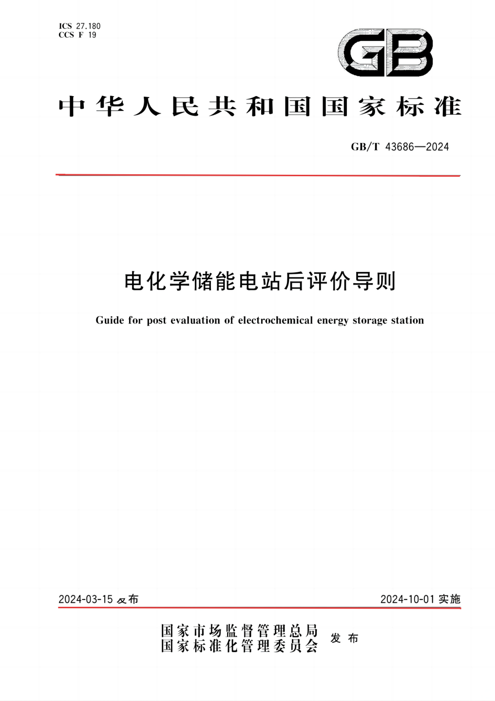

# 统一PDF分析器 (Unified PDF Analyzer)

一个功能强大的PDF文档分析工具，支持自动特征检测、分类和可视化分析。



## 🔍 图片特征识别原理

本工具基于标准模板图片 `mb.png` 进行PDF文档的特征识别和分类。识别过程包含三个核心特征，每个特征都有其独特的检测手段和原理：

### 第一特征：颜色特征检测

**检测内容**：白色背景 + 黑色文字的标准文档格式

**检测手段**：
- **RGB颜色分析**：分析图像中每个像素的RGB值
- **像素比例统计**：计算白色背景像素和黑色文字像素的占比
- **亮度和对比度分析**：评估整体图像的明暗对比程度
- **彩色文字检测**：识别非黑白色的彩色文字内容

**检测原理**：
1. **白色背景检测**：RGB值 ≥ 200的像素被识别为白色背景，要求占比 ≥ 95%
2. **黑色文字检测**：RGB值 ≤ 80的像素被识别为黑色文字，要求占比 ≥ 0.1%
3. **亮度验证**：整体平均亮度 ≥ 244，确保文档足够明亮
4. **对比度验证**：标准差 ≥ 26，确保文字与背景有足够对比度
5. **彩色文字控制**：彩色文字比例 ≤ 5%，避免过度彩色化

### 第二特征：结构线条检测

**检测内容**：两条长黑线的存在和位置

**检测手段**：
- **形态学处理**：使用OpenCV的形态学操作连接断开的线段
- **自适应阈值**：根据图像尺寸动态调整检测参数
- **线条质量评估**：综合考虑线条长度、宽度和位置
- **分组和合并**：将相近的短线段合并为完整的长线

**检测原理**：
1. **黑色像素掩码**：创建RGB值 < 80的黑色区域掩码
2. **水平线段检测**：逐行扫描，寻找连续黑色像素段
3. **长度筛选**：要求线段长度 ≥ 70%页面宽度
4. **宽度验证**：线条垂直宽度 ≤ 页面高度的2%，避免误识别文字行
5. **质量评分**：综合长度(40%)、宽度(40%)、位置(20%)计算质量分数
6. **间距验证**：两条线间距 ≥ 45%页面高度，确保合理分布

### 第三特征：区域分区检测

**检测内容**：基于两条长黑线将页面分为三个区域，并识别各区域的关键文字

**检测手段**：
- **区域划分**：根据第二特征检测到的两条长黑线位置进行分区
- **文字识别**：在各区域内检测特定关键词的存在
- **空间关系分析**：验证区域划分的合理性和完整性

**检测原理**：
1. **上部区域**：第一长黑线之上的区域，应包含"标准"二字
2. **中部区域**：两条长黑线之间的区域，应包含"发布"二字
3. **下部区域**：第二长黑线之下的区域，应包含"发布"二字
4. **分区原则**：
   - 第一长黑线位置作为上中分界线
   - 第二长黑线位置作为中下分界线
   - 每个区域独立进行文字特征检测
   - 确保三个区域覆盖整个页面高度

**技术实现**：
- 使用OCR技术识别各区域内的文字内容
- 通过关键词匹配验证区域内容的正确性
- 结合空间位置信息提高识别准确性
- 支持多种字体和文字大小的自适应识别

## 🚀 主要功能

### 1. 递归分类模式 (Recursive Classification Mode)
- 自动扫描指定文件夹下的所有PDF文件
- 进行两阶段特征验证
- 自动复制符合条件的文件到目标文件夹
- 生成详细的处理报告

### 2. 特定文件分析模式 (Specific File Analysis Mode)
- 分析指定的PDF文件
- 生成带有长黑线标识的图片
- 可视化特征检测结果
- 保存分析图片到目标文件夹

### 3. 编程接口 (Programmatic Interface)
- 提供完整的Python API
- 支持自定义分析流程
- 灵活的结果处理

## 📋 系统要求

- Python 3.7+
- Windows/Linux/macOS

## 🔧 安装依赖

```bash
pip install -r requirements.txt
```

### 主要依赖包
- `PyMuPDF` - PDF文件处理
- `OpenCV` - 图像处理和计算机视觉
- `NumPy` - 数值计算
- `Pillow` - 图像处理
- `pathlib` - 路径处理

## 🎯 快速开始

### 1. 基本用法

```bash
# 递归分类模式
python pdf_analyzer.py input_pdfs --mode recursive

# 特定文件分析模式
python pdf_analyzer.py input_pdfs --mode specific

# 指定目标文件夹
python pdf_analyzer.py input_pdfs --target output --mode recursive
```

### 2. 编程接口

```python
from pdf_analyzer import UnifiedPDFAnalyzer

# 创建分析器
analyzer = UnifiedPDFAnalyzer("input_pdfs", "jc")

# 运行递归分类
analyzer.run_analysis(mode="recursive")

# 运行特定文件分析
results = analyzer.run_analysis(mode="specific")

# 手动调用方法
pdf_path = analyzer.find_pdf_file("filename.pdf")
if pdf_path:
    image = analyzer.pdf_to_image(pdf_path)
    first_pass = analyzer.check_first_feature(image)
    second_pass = analyzer.check_second_feature(image)
    analyzer.detectAnd_visualize_lines(image, "filename")
```

## 📁 项目结构

```
pdfClassify/
├── pdf_analyzer.py          # 统一PDF分析器主文件
├── pdf_feature_extractor.py # PDF特征提取器
├── demo.py                  # 演示脚本
├── usage_example.py         # 使用示例
├── requirements.txt         # 依赖包列表
├── input_pdfs/             # 输入PDF文件夹
├── jc/                     # 输出文件夹（默认）
├── templates/              # 模板图片
├── data/                   # 数据文件夹
└── tests/                  # 测试文件夹
    ├── logs/               # 日志文件
    ├── data/               # 测试数据
    ├── feature_analysis/   # 特征分析测试
    ├── line_detection/     # 线条检测测试
    ├── validation/         # 验证测试
    └── visualization/      # 可视化测试
```

## 🔍 特征检测算法

### 第一特征检测
- 白色背景比例检测
- 黑色文字比例检测
- 整体亮度和对比度分析
- 彩色文字比例控制

```python
color_thresholds = {
    'white_bg_min': 200,      # 白色背景最小RGB值
    'black_text_max': 80,     # 黑色文字最大RGB值
    'bg_ratio_min': 0.95,     # 背景色占比最小值
    'text_ratio_min': 0.001,  # 文字色占比最小值
    'contrast_min': 26,       # 最小对比度
    'brightness_min': 244,    # 最小亮度
    'colored_text_max': 0.05  # 彩色文字最大允许比例
}
```

### 第二特征检测
- 长黑线检测
- 形态学处理
- 线条质量评估
- 自适应阈值调整


## 📊 输出结果

### 1. 文件复制
- 符合条件的PDF文件自动复制到目标文件夹
- 保持原始文件名和目录结构

### 2. 可视化结果
- 生成带有特征标记的分析图片
- 保存到目标文件夹中

### 3. 统计报告
- 处理文件总数
- 各阶段通过率
- 详细的结果记录

### 4. JSON格式结果
- 完整的分析结果保存为JSON文件
- 包含时间戳、统计信息和文件详情

## 🛠️ 高级用法

### 1. 自定义配置
```python
# 创建自定义特征提取器
from pdf_feature_extractor import PDFFeatureExtractor

extractor = PDFFeatureExtractor(
    template_path="custom_template.png",
    data_dir="custom_data"
)

# 修改阈值配置
extractor.color_thresholds['white_bg_min'] = 180
extractor.color_thresholds['contrast_min'] = 30
```

### 2. 批量处理
```python
# 批量处理多个文件夹
folders = ["folder1", "folder2", "folder3"]
for folder in folders:
    analyzer = UnifiedPDFAnalyzer(folder, f"output_{folder}")
    analyzer.run_analysis(mode="recursive")
```

### 3. 结果过滤
```python
# 根据结果过滤文件
results = analyzer.run_analysis(mode="specific")
filtered_results = [r for r in results if r.get('copied', False)]
```

## 📝 使用示例

### 1. 运行演示脚本
```bash
python demo.py
```

### 2. 运行使用示例
```bash
python usage_example.py
```

### 3. 运行测试
```bash
python test_unified_analyzer.py
```

## 🔧 故障排除

### 常见问题

1. **依赖安装失败**
   ```bash
   pip install --upgrade pip
   pip install -r requirements.txt
   ```

2. **PDF文件无法读取**
   - 检查文件是否损坏
   - 确认文件权限
   - 尝试用其他PDF阅读器打开

3. **内存不足**
   - 减少同时处理的文件数量
   - 降低图像分辨率
   - 分批处理大文件

4. **特征检测不准确**
   - 调整阈值参数
   - 检查模板图片质量
   - 验证输入文件格式

### 日志文件
- 主日志：`tests/logs/pdf_analyzer.log`
- 分类日志：`tests/logs/pdf_classify.log`
- 验证日志：`tests/logs/pdf_validation.log`

## 🤝 贡献指南

1. Fork 项目
2. 创建功能分支
3. 提交更改
4. 推送到分支
5. 创建 Pull Request

## 📄 许可证

本项目采用 MIT 许可证 - 查看 [LICENSE](LICENSE) 文件了解详情

## 📞 联系方式

如有问题或建议，请通过以下方式联系：
- 提交 Issue
- 发送邮件
- 参与讨论

## 🙏 致谢

感谢所有为这个项目做出贡献的开发者和用户！

---

**注意**: 使用前请确保已正确安装所有依赖包，并准备好测试用的PDF文件。

